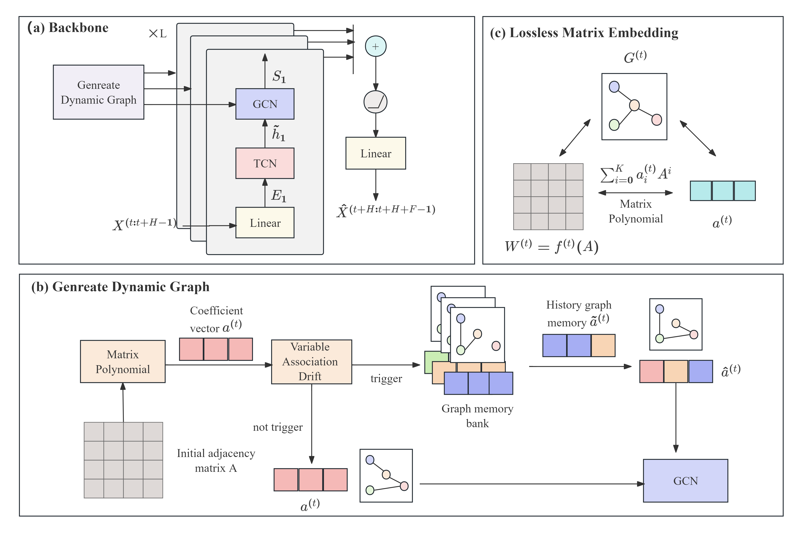

# Learning Dynamic Variable Association for Online Time Series Forecasting

## Introduction

Time series forecasting is integral to diverse fields, significantly influencing both industrial production and human activities. However, in the real world, time series data often encounter the issue of concept drift, which refers to the continuous change in data distribution over time. This results in a gradual decline in the performance of traditional deep learning models as time progresses. Current mainstream online time series learning methods alleviate the issue of concept drift by employing efficient self-updating mechanisms which operate on streaming data. However, they overlook the changes in the variable association within time series. This paper, for the first time, introduces the concept of dynamic graphs into the online learning mechanism for time series, proposing the Online Dynamic Graph Network (ODGNet). Based on matrix polynomial, this paper establishes a lossless information mapping between the adjacency matrix and its corresponding coefficient. Furthermore, ODGNet incorporates a lightweight variable association drift perception mechanism and a graph memory module,  providing a more comprehensive modeling of online time series learning scenarios. In the variable drift perception mechanism, it efficiently perceives changes in the graph structure through the differences between the matrix polynomial coefficients. In the graph memory module, it achieves the storage of inter-variable association patterns with low memory consumption by storing coefficient vectors.  Experimental results demonstrate that ODGNet outperforms the current state-of-the-art online learning architectures for time series  on multiple public time series forecasting datasets.


## Requirements

- python ~= 3.8.0
- pytorch ~= 1.9.0
- numpy ~= 1.21.2
- yaml ~= 0.2.5
- pyyaml ~= 6.0
- tqdm ~= 4.61.2
- pandas ~= 2.0.3
- einops ~= 0.8.0

## Benchmarking

### 1. Data preparation

We follow the same data formatting as the Informer repo (https://github.com/zhouhaoyi/Informer2020), which also hosts the raw data.
Please put all raw data (csv) files in the ```./data``` folder.

### 2. Run experiments

To replicate our results of ODGNet on the ETT, ECL and WTH datasets, run
```
sh ./scripts/odgnet.sh
```
### 2. Run experiments

To replicate our results of OneNet-ODG run
```
sh ./scripts/onenet_odg.sh
```

### 3.  Arguments

**Model:** Our implementation supports the following training strategies:
- wo_dg: ODGNet without matrix polynomial module
- wo_memory: ODGNet without graph memory module
- wo_trigger: ODGNet sharing the same trigger with FSNet.
- odgnet: the proposed ODGNet framework
- onenet_odg: the ensemble of  ODGNet and Time-FSNet by OneNet


You can specify one of the above method via the ```--model_name``` argument. Please also modify the model name in the ```ODGNet_model_config.yaml``` file accordingly

**Dataset:** Our implementation currently supports the following datasets: Electricity Transformer - ETT (including ETTh1, ETTh2, ETTm1, and ETTm2), ECL and WTH. You can specify the dataset via the ```--data_config_path``` argument.

**Other arguments:** Other useful arguments in ```./data_config``` folder and for ```./train_config``` folder experiments are:
- ```test_bsz```: batch size used for testing: must be set to **1** for online learning,
- ```history_len```: look-back windows' length, set to **60** by default,
- ```forecast_len```: forecast windows' length, set to **1** for online learning.